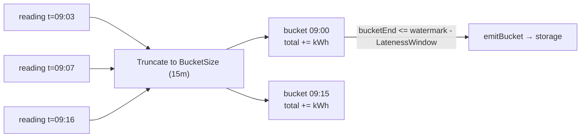
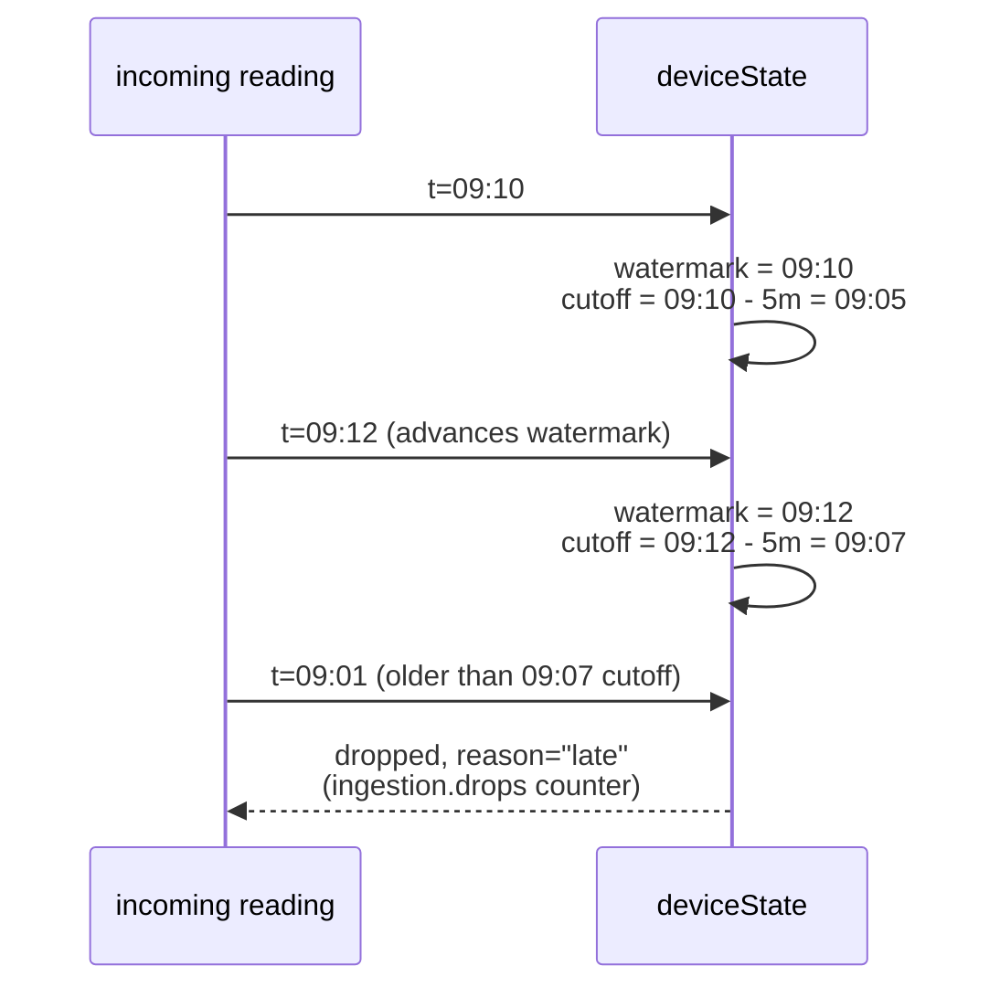
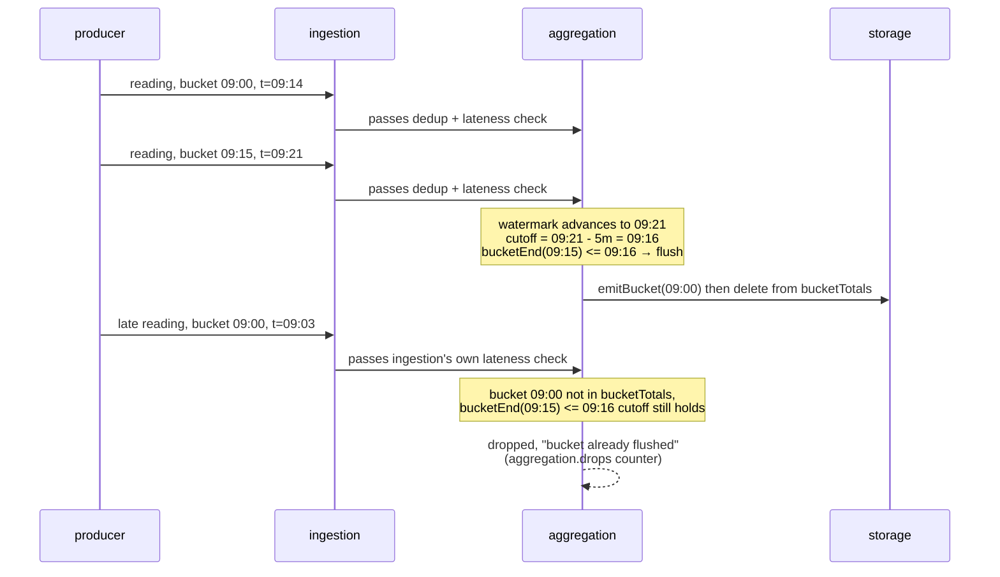

# Wattflow

A Go pipeline simulating energy telemetry ingestion: correctness under out-of-order/duplicate/bursty event delivery, a deliberate backpressure policy, and OpenTelemetry observability across pipeline stages.

Not a production system (no auth/multi-tenancy/UI) and not a Kafka/Flink clone — a focused subset of the same problem, built to be defensible in depth rather than broad.

## Status

Pipeline is built end to end: producer, ingestion (dedup + watermark), aggregation, batched storage, and OpenTelemetry observability, with graceful shutdown, a drop-counter metric, ingestion unit tests, and a CI workflow running `gofmt`, `go vet`, and `go test -race`. See [SPEC.md](SPEC.md) for the full requirements/design doc.

## Results

- **21,831 events/sec** throughput ceiling, from a measured config sweep (channel buffer size x batch size x flush timeout).
- **164.78MB → 99.34MB** allocation reduction in the hottest storage path, from CPU/heap profiling that found and fixed two concrete allocation sources.

Full perf matrix and profiling narrative: [.scratch/wattflow/issues/](.scratch/wattflow/issues/) — detailed working logs behind these numbers.

## Prerequisites

- A Postgres/TimescaleDB instance reachable at the DSN hardcoded in `cmd/wattflow/main.go` (`localhost:5432` by default) — `go run ./cmd/wattflow` connects to it directly, it does not start one for you:

  ```
  docker compose up -d
  ```

  `internal/storage`'s tests spin up their own via testcontainers (Docker required), separate from this.
- An OTel collector listening on `localhost:4317` (see `cmd/wattflow/otel.go`) — without one, spans/metrics/logs fail to export silently, no error surfaced. See the [SigNoz docs](https://signoz.io/docs/install/docker/) for a local collector setup.

## Correctness invariant

For a fixed input set of events, the final per-`device_id`/per-interval kWh aggregate is bitwise-identical regardless of delivery order or duplication. Covered by an automated replay harness (in-order, reordered, duplicated, mixed patterns) intended to run in CI — see [SPEC.md](SPEC.md#correctness-requirements-highest-priority).

## Architecture

Pipeline stages connected by bounded channels, each its own module under `internal/`:

1. **producer** — synthetic meter-reading generator, configurable for out-of-order/duplicate/delayed/burst delivery.
2. **ingestion** — dedup by `reading_id`, watermark with bounded allowed-lateness window.
3. **aggregation** — total kWh per device per fixed time bucket, order/duplication-independent.
4. **storage** — batched writes to Postgres/TimescaleDB.
5. **observability** — OpenTelemetry tracing, per-stage latency, end-to-end per event.

Backpressure: bounded channels between every stage pair, with one explicit, documented policy for what happens when a downstream stage falls behind. See [SPEC.md](SPEC.md) for the full rationale.

## Concepts

### Reading → bucket

Each reading is truncated to its bucket start (`Timestamp.Truncate(BucketSize)`) and its `kWh` accumulated into that bucket's running total, per device:



### Watermark & lateness window (ingestion)

Per device, `watermark` tracks the latest `Timestamp` seen so far. Every reading is checked against `cutoff = watermark - LatenessWindow` before dedup. Example with `LatenessWindow = 5m`:



### The too-late problem: bucket already flushed

Ingestion's lateness check only guards *dedup state* eviction. Aggregation keeps its **own** per-device watermark and flushes (emits + deletes) a bucket once `bucketEnd <= watermark - LatenessWindow` — a reading can pass ingestion's check yet still arrive after aggregation has already flushed and forgotten its bucket. Example with `BucketSize = 15m`, `LatenessWindow = 5m`, bucket `09:00–09:15`:



## Commands

```
go build ./...
go run ./cmd/wattflow
go test ./...
go test ./test/correctness/...   # correctness/replay harness
go vet ./...
```

Or via Makefile: `make build`, `make run`, `make test`, `make test-correctness`, `make vet`.

## Profiling

CPU/heap/block profiles from a real load test run, no code changes needed — `go test -bench` supports these natively. Sweet-spot config from the throughput matrix (see `.scratch/wattflow/issues/06-load-test-perf-tuning.md`):

```
go test ./test/loadtest/ -run ^$ \
  -bench 'BenchmarkPipelineThroughputMatrix/buf=256/batch=64KB/flush=5s' \
  -benchtime 1x \
  -cpuprofile cpu.prof -memprofile mem.prof \
  -blockprofile block.prof -blockprofilerate 1 \
  > bench_run.txt
```

Analysis, saved to text for review:

```
go tool pprof -top -cum cpu.prof         > cpu_top_cum.txt
go tool pprof -top -alloc_space mem.prof > mem_top_allocspace.txt
go tool pprof -top -cum block.prof       > block_top_cum.txt

go tool pprof -list=flushReadings cpu.prof   > cpu_list_flushReadings.txt
go tool pprof -list=ToSql cpu.prof           > cpu_list_tosql.txt
go tool pprof -list=flushReadings mem.prof   > mem_list_flushReadings.txt
go tool pprof -list=flushReadings block.prof > block_list_flushReadings.txt
```

Or via Makefile, whole chain in one command: `make profile`.

Note: CPU profile only samples on-CPU time — a goroutine blocked on a network read (e.g. `pool.Exec` waiting on the DB round-trip) shows up as nothing, not as cost. Check `Total samples` vs `Duration` in the profile header; low coverage means the workload is I/O-bound and `block.prof` is the more informative profile.